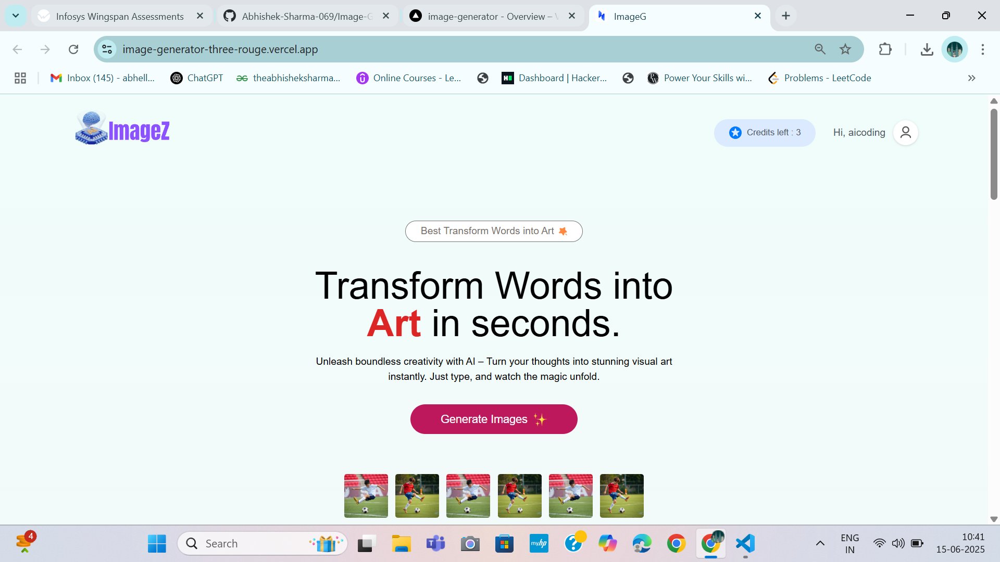
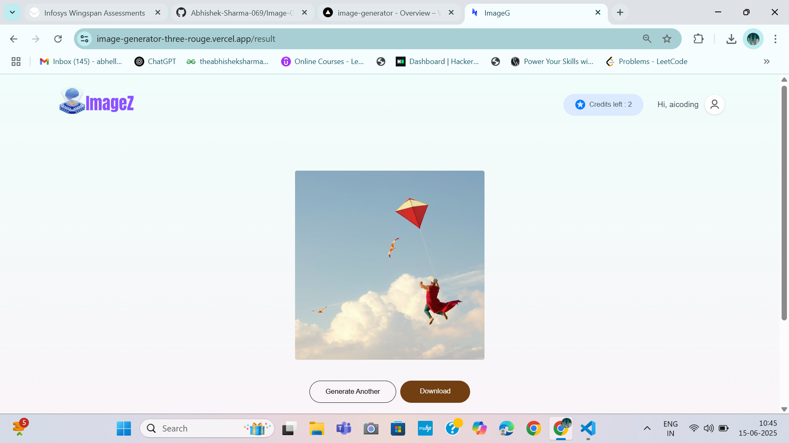

# Image Generator

<p align="center">
  
</p>

<p align="center">
  <a href="https://reactjs.org/">
    
  </a>
  <a href="https://vitejs.dev/">
    
  </a>
  <a href="https://expressjs.com/">
    
  </a>
  <a href="https://www.mongodb.com/">
    
  </a>
  <a href="https://vercel.com/">
    
  </a>
  <a href="https://tailwindcss.com/">
    
  </a>
  <a href="https://razorpay.com/">
    
  </a>
  
</p>

---

# 🚀 Image Generator

AI-powered web app to generate stunning images from text prompts. Users can sign up, log in, generate images, manage credits, and purchase more credits securely. Built with a modern stack and deployed on Vercel for seamless performance.

## ✨ Features
- 🔥 Generate images from text prompts using AI (ClipDrop API)
- 🔒 Secure user authentication (JWT)
- 💳 Credit system (free on signup, paid via Razorpay)
- 🖼️ Gallery of generated images
- 📱 Responsive, modern UI with Tailwind CSS
- 💬 Popup welcome modal for new visitors
- 🛡️ Robust error handling and CORS
- 🗃️ MongoDB for persistent storage
- ⚡ Fast, serverless backend on Vercel

## 📸 Screenshots
<p align="center">
  
  
</p>

## 🛠️ Tech Stack
- **Frontend:** React, Vite, Tailwind CSS
- **Backend:** Node.js, Express.js
- **Database:** MongoDB Atlas
- **Payments:** Razorpay
- **Image Generation:** ClipDrop API
- **Deployment:** Vercel

## 📂 Folder Structure
```
Image-Generator/
├── client/      # React frontend
│   ├── public/
│   ├── src/
│   └── ...
├── server/      # Express backend
│   ├── config/
│   ├── controllers/
│   ├── middleware/
│   ├── models/
│   ├── routes/
│   └── ...
└── README.md
```

## ⚙️ Environment Variables
Set these in both your local `.env` and Vercel dashboard:
- `MONGO_URL` - MongoDB connection string
- `JWT_SECRET` - Secret for JWT authentication
- `CLIPDROP_API_KEY` - API key for image generation
- `RAZORPAY_KEY_ID` - Razorpay public key
- `RAZORPAY_KEY_SECRET` - Razorpay secret key

## 🧑‍💻 Getting Started

### Prerequisites
- Node.js (v18+ recommended)
- npm or yarn
- MongoDB Atlas account
- Razorpay account (for payments)

### Local Development
1. **Clone the repo:**
   ```bash
   git clone <repo-url>
   cd Image-Generator
   ```
2. **Install dependencies:**
   ```bash
   cd client && npm install
   cd ../server && npm install
   ```
3. **Set up environment variables:**
   - Create `.env` files in both `client` and `server` folders as needed.
4. **Run the app locally:**
   - Start backend:
     ```bash
     cd server
     npm run dev
     ```
   - Start frontend:
     ```bash
     cd ../client
     npm run dev
     ```
   - Frontend: http://localhost:3000
   - Backend: http://localhost:4000

### Deployment (Vercel)
- Both frontend and backend are deployed as separate projects on Vercel.
- Ensure all environment variables are set in the Vercel dashboard for both projects.
- Backend uses `vercel.json` for serverless deployment.

## 📝 API Endpoints
- `POST /api/user/login` — User login
- `POST /api/user/register` — User registration
- `POST /api/image/generate` — Generate image from prompt
- `GET /api/user/credits` — Get user credits
- `POST /api/user/buy-credits` — Buy more credits

## 🙋 FAQ
**Q: How many free credits do I get?**  
A: Every new user gets 5 free credits on signup.

**Q: Can I use my own API key for image generation?**  
A: Yes, set your `CLIPDROP_API_KEY` in the environment variables.

**Q: Is payment secure?**  
A: Yes, payments are handled securely via Razorpay.

## 👨‍🎨 Credits
- Built by Abhishek Sharma
- AI image generation powered by [ClipDrop](https://clipdrop.co/)

## 📄 License
This project is licensed under the MIT License.
